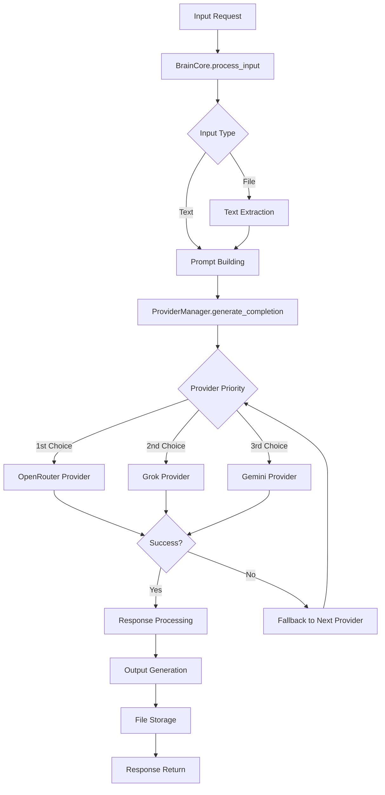
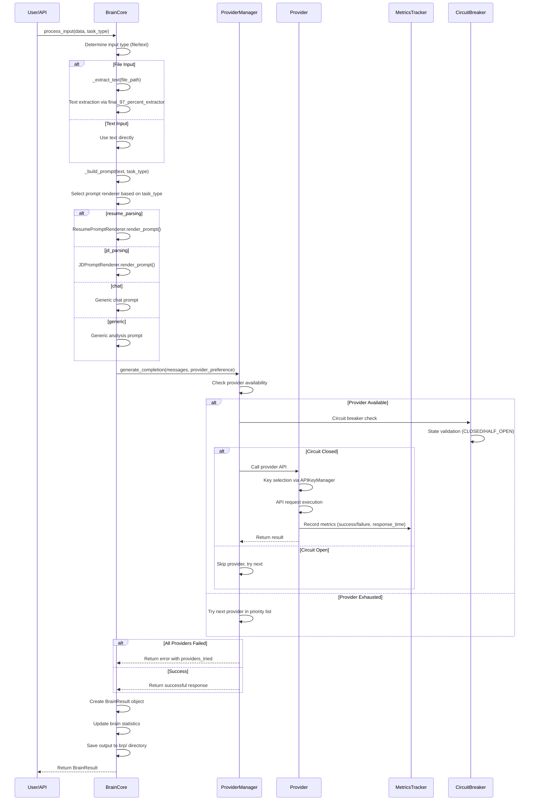
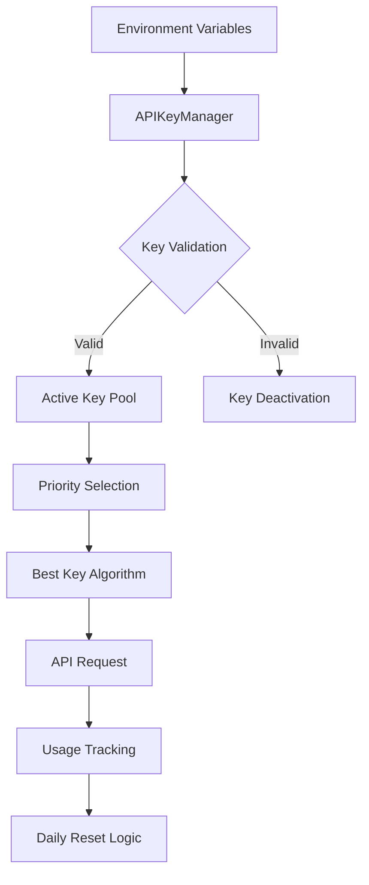
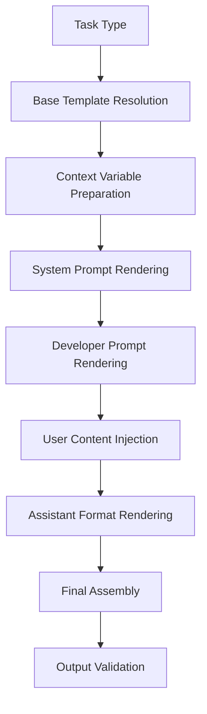
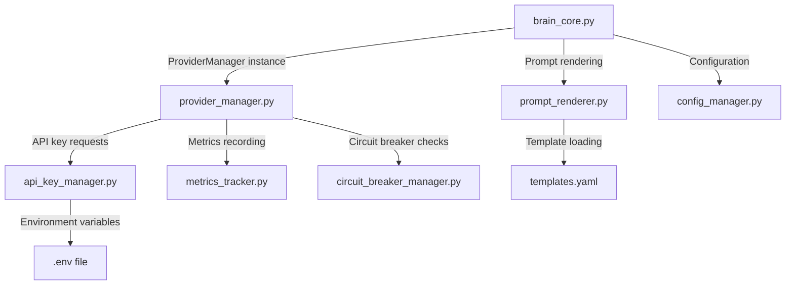
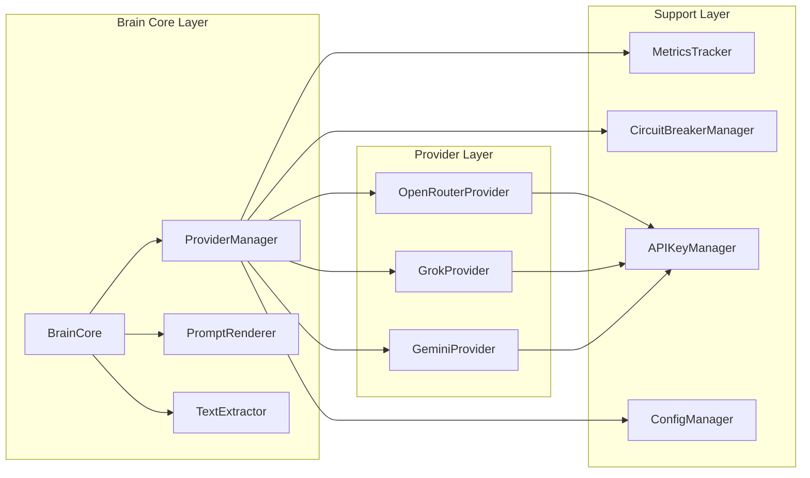
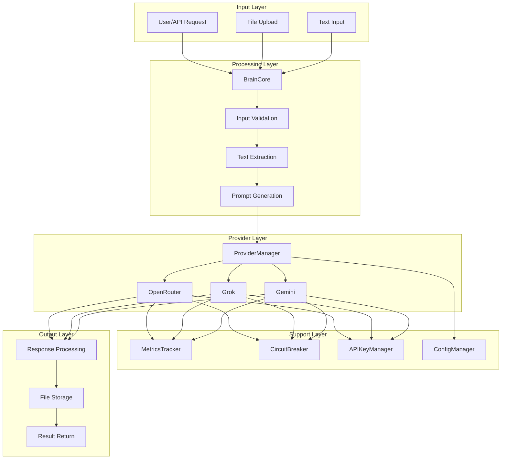
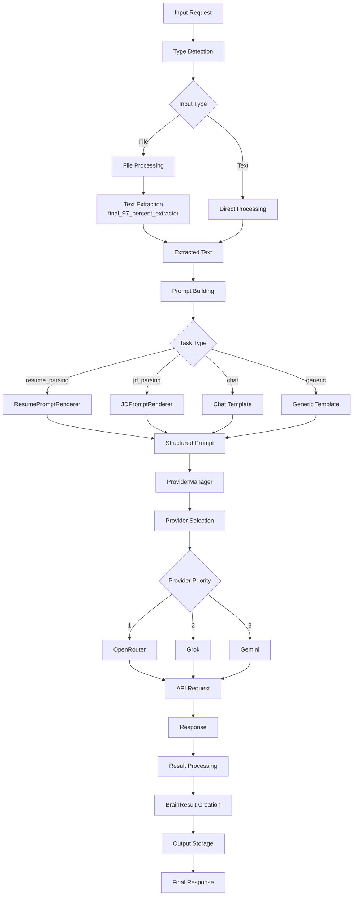
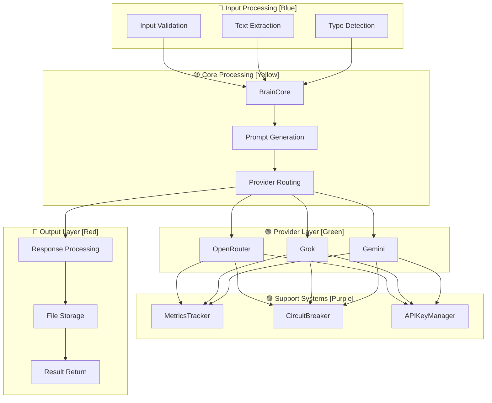

# Brain Module System Architecture Documentation

## Table of Contents
1. [System Overview](#system-overview)
2. [Query Processing Pipeline](#query-processing-pipeline)
3. [Key Management & Retrieval System](#key-management--retrieval-system)
4. [Prompt Generation Framework](#prompt-generation-framework)
5. [File & Component Responsibility Matrix](#file--component-responsibility-matrix)
6. [Visual Architecture Maps](#visual-architecture-maps)
7. [Technical Specifications](#technical-specifications)
8. [Error Handling & Fallback Mechanisms](#error-handling--fallback-mechanisms)

---

## System Overview

The Brain Module is a sophisticated AI orchestration system designed to provide intelligent query processing, multi-provider LLM integration, and comprehensive monitoring capabilities. The system follows a modular architecture with clear separation of concerns.

### Core Components

```
┌─────────────────────────────────────────────────────────────────┐
│                    BRAIN MODULE CORE                            │
├─────────────────────────────────────────────────────────────────┤
│  BrainCore (Main Orchestrator)                                  │
│  ├── ProviderManager (Multi-LLM Routing)                       │
│  ├── PromptRenderer (Template Management)                       │
│  ├── TextExtractor (File Processing)                            │
│  └── Worker (Background Task Processing)                        │
├─────────────────────────────────────────────────────────────────┤
│  PROVIDERS LAYER (OpenRouter, Grok, Gemini)                    │
├─────────────────────────────────────────────────────────────────┤
│  SUPPORTING SYSTEMS                                             │
│  ├── MetricsTracker (Performance Monitoring)                   │
│  ├── CircuitBreakerManager (Fault Tolerance)                   │
│  ├── APIKeyManager (Key Rotation)                              │
│  └── ConfigManager (Configuration Management)                   │
└─────────────────────────────────────────────────────────────────┘
```

### System Flow Architecture



---

## Query Processing Pipeline

### Complete Processing Flow



### Data Transformation Stages

| Stage | Input | Output | Processing Logic |
|-------|-------|--------|------------------|
| **Input Validation** | Raw user input | Validated input | Type detection, format validation |
| **Text Extraction** | File bytes | Extracted text | Multi-format PDF/DOC processing |
| **Prompt Assembly** | Raw text + task type | Structured prompt | Template rendering with Jinja2 |
| **Provider Routing** | Messages list | Provider selection | Priority-based fallback logic |
| **API Execution** | Provider-specific request | LLM response | HTTP request with retry logic |
| **Response Processing** | Raw API response | Structured result | JSON parsing, error handling |
| **Output Storage** | Processed result | File storage | JSON serialization with metadata |

### Entry and Exit Points

#### Entry Points
- **Primary Entry**: [`BrainCore.process_input()`](Backend/backend_app/brain_module/brain_core.py:121)
- **Worker Entry**: [`worker.process_task()`](Backend/backend_app/brain_module/worker.py:32)
- **API Entry**: [`api/v1/brain.py`](Backend/backend_app/api/v1/brain.py)

#### Exit Points
- **Success Response**: [`BrainResult`](Backend/backend_app/brain_module/brain_core.py:41) object with structured data
- **Failure Response**: [`BrainResult`](Backend/backend_app/brain_module/brain_core.py:41) with error information
- **Async Response**: Celery task result via worker system

---

## Key Management & Retrieval System

### Key Detection Mechanism

The system implements a sophisticated key detection and management system with the following components:



### Key Source Locations and Retrieval Pathways

#### Environment Variable Mapping
```yaml
providers:
  openrouter:
    api_key_envs: 
      - OPENROUTER_API_KEY    # Primary key
      - OPENROUTER_KEY_2      # Secondary key
      - OPENROUTER_KEY_3      # Backup key
  grok:
    api_key_envs:
      - GROQ_API_KEY          # Primary key
      - GROQ_API_KEY_2        # Secondary key
  gemini:
    api_key_envs:
      - GEMINI_API_KEY        # Primary key
      - GEMINI_API_KEY_2      # Secondary key
```

#### Key Retrieval Flow
1. **Configuration Loading**: [`ProviderConfigManager.load_configuration()`](Backend/backend_app/brain_module/providers/config_manager.py:60)
2. **Environment Validation**: Check for existence of required environment variables
3. **Key Pool Creation**: Build active key list per provider
4. **Priority Assignment**: Assign priority levels (1 = highest)
5. **Health Monitoring**: Track key performance and failure rates

### Fracture Point Analysis

#### Key Partitioning Points
1. **Provider Level**: Keys are partitioned by provider (OpenRouter, Grok, Gemini)
2. **Priority Level**: Keys within each provider have priority ordering
3. **Daily Limit Partitioning**: 1000 calls per provider per day
4. **Failure Threshold Partitioning**: Keys deactivated after 3 consecutive failures

#### Key Dispersion Logic
```python
# Key dispersion across providers
provider_priority = ["openrouter", "grok", "gemini"]
key_rotation_strategy = "priority_based"
failure_threshold = 3
daily_limit = 1000
```

### Key Distribution and Allocation Logic

#### Best Key Selection Algorithm
```python
def get_best_key(self) -> Optional[str]:
    """Get the best available API key based on priority and health"""
    available_keys = []
    
    for key_name, status in self.key_status.items():
        # Filter criteria:
        # - Key must be enabled
        # - Key must be active
        # - Key must not be exhausted
        # - Key must not exceed failure threshold
        
        if (status.key_config.enabled and 
            status.is_active and 
            not status.is_exhausted and
            status.consecutive_failures < status.key_config.max_failures):
            
            available_keys.append((key_name, status.key_config.priority, status.calls_remaining))
    
    # Sort by priority (lower = higher) then by remaining calls (higher = better)
    available_keys.sort(key=lambda x: (x[1], -x[2]))
    
    return available_keys[0][0] if available_keys else None
```

#### Call Limit Enforcement
- **Provider Level**: 1000 calls per provider per day
- **Key Level**: Configurable daily limits per key
- **Automatic Reset**: Daily reset at UTC 00:00
- **Exhaustion Handling**: Automatic key rotation when limits reached

---

## Prompt Generation Framework

### Prompt Creation Methodology

The system uses a template-based approach with Jinja2 for dynamic prompt generation:


### Template Structure and Hierarchy

#### Template Configuration
```yaml
# templates.yaml structure
resume_parsing:
  base: base_comprehensive
  system: |
    You are an expert resume parser...
  developer: |
    Extract all resume fields...
  user: |
    Extract all resume fields from: {{ resume_text }}
  assistant: |
    Return structured JSON output...

jd_parsing:
  base: base_comprehensive
  system: |
    You are an expert job description analyzer...
  developer: |
    Extract job requirements...
  user: |
    Analyze the following job description: {{ jd_text }}
  assistant: |
    Return structured JSON output...

chat:
  system: |
    You are a helpful assistant...
  user: |
    {{ user_message }}
```

### Responsible Profile Identification

#### Profile Assignment Logic
```python
def _get_profile_context(self, task_type: str) -> Dict[str, Any]:
    """Get context variables for prompt rendering"""
    profiles = {
        "resume_parsing": {
            "role": "expert_resume_parser",
            "expertise": "HR recruitment and resume analysis",
            "output_format": "structured JSON",
            "strict_mode": True
        },
        "jd_parsing": {
            "role": "job_description_analyst", 
            "expertise": "HR job analysis and requirement extraction",
            "output_format": "structured JSON",
            "strict_mode": True
        },
        "chat": {
            "role": "helpful_assistant",
            "expertise": "general conversation and information",
            "output_format": "natural language",
            "strict_mode": False
        }
    }
    return profiles.get(task_type, profiles["chat"])
```

### Profile Selection Criteria

| Task Type | Profile | Expertise Level | Output Format | Strict Mode |
|-----------|---------|-----------------|---------------|-------------|
| `resume_parsing` | Expert Resume Parser | HR Recruitment Specialist | Structured JSON | ✅ |
| `jd_parsing` | Job Description Analyst | HR Job Analysis Expert | Structured JSON | ✅ |
| `chat` | Helpful Assistant | General Knowledge | Natural Language | ❌ |
| `generic` | Data Analyst | Information Processing | Structured/Text | ⚠️ |

### Prompt Assembly Sequence

#### Step-by-Step Assembly Process
1. **Base Template Resolution**: Resolve template inheritance chain
2. **Context Variable Preparation**: Prepare task-specific context
3. **System Prompt Rendering**: Render system instructions
4. **Developer Prompt Rendering**: Render developer guidelines
5. **User Prompt Rendering**: Inject user content
6. **Assistant Prompt Rendering**: Render expected response format
7. **Final Assembly**: Combine all rendered parts with separators

#### Dependency Chain


---

## File & Component Responsibility Matrix

### Detailed File-to-Function Mapping

| File | Primary Responsibility | Key Functions | Dependencies |
|------|----------------------|---------------|--------------|
| [`brain_core.py`](Backend/backend_app/brain_module/brain_core.py) | Main orchestrator | `process_input()`, `_extract_text()`, `_build_prompt()` | ProviderManager, TextExtractor, PromptRenderer |
| [`provider_manager.py`](Backend/backend_app/brain_module/providers/provider_manager.py) | Multi-provider routing | `generate_completion()`, `add_provider_api_key()` | All providers, MetricsTracker, CircuitBreaker |
| [`api_key_manager.py`](Backend/backend_app/brain_module/providers/api_key_manager.py) | Key rotation & health | `get_best_key()`, `record_key_usage()` | Environment variables, Configuration |
| [`config_manager.py`](Backend/backend_app/brain_module/providers/config_manager.py) | Configuration management | `load_configuration()`, `get_provider_keys()` | YAML files, Environment variables |
| [`metrics_tracker.py`](Backend/backend_app/brain_module/providers/metrics_tracker.py) | Performance monitoring | `record_api_call()`, `get_provider_metrics()` | JSON storage, Time tracking |
| [`circuit_breaker_manager.py`](Backend/backend_app/brain_module/providers/circuit_breaker_manager.py) | Fault tolerance | `get_breaker()`, `get_all_stats()` | State management, Error tracking |
| [`prompt_renderer.py`](Backend/backend_app/brain_module/prompt_renderer.py) | Template management | `render()`, `reload()` | Jinja2, YAML templates |
| [`resume_prompt.py`](Backend/backend_app/brain_module/prompts/resume_prompt.py) | Resume parsing prompts | `render_prompt()` | Jinja2, Resume templates |
| [`jd_prompt.py`](Backend/backend_app/brain_module/prompts/jd_prompt.py) | Job description prompts | `render_prompt()` | Jinja2, JD templates |
| [`templates.yaml`](Backend/backend_app/brain_module/prompts/templates.yaml) | Template definitions | Template definitions | YAML format |

### Counting Mechanism Implementation

#### Call Counting Strategy
```python
# Provider-level counting (1000 limit per day)
self.provider_call_limit = 1000
self.provider_calls_today = 0

# Key-level counting (configurable per key)
status.calls_today += 1
status.calls_remaining = max(0, key_config.daily_limit - status.calls_today)

# Aggregated statistics for monitoring
total_calls = sum(key.calls_today for key in all_keys)
success_rate = (successful_calls / total_calls) * 100 if total_calls > 0 else 0
```

#### Data Aggregation Files
- **Metrics Storage**: [`logs/metrics.json`](logs/metrics.json) - Individual API key performance
- **Output Storage**: [`brp/`](brp/) directory - Processed results with metadata
- **Log Files**: [`logs/provider_manager.log`](logs/provider_manager.log) - System operation logs

### Inter-file Communication Protocols

#### Data Exchange Patterns


#### Communication Interfaces
1. **Provider Interface**: Standardized `generate_completion()` method across all providers
2. **Key Management Interface**: `get_best_key()`, `record_key_usage()` methods
3. **Metrics Interface**: `record_api_call()`, `get_provider_metrics()` methods
4. **Configuration Interface**: `load_configuration()`, provider-specific getters

### Module Interaction Diagrams

#### Core Module Interactions


---

## Visual Architecture Maps

### System Architecture Overview



### Data Flow Architecture



### Component Interaction Symbols

| Symbol | Component Type | Description |
|--------|----------------|-------------|
| 🧠 | Brain Core | Main processing orchestrator |
| 🔌 | Provider | LLM service integration |
| 🔑 | Key Manager | API key rotation and health |
| 📊 | Metrics Tracker | Performance monitoring |
| 🔒 | Circuit Breaker | Fault tolerance management |
| 📝 | Prompt Renderer | Template management |
| 📁 | File Handler | Text extraction and storage |
| ⚙️ | Config Manager | Configuration management |
| 🔄 | Worker | Background task processing |

### Color-Coded Functional Areas



---

## Technical Specifications

### API Endpoints and Communication Protocols

#### Brain Module API Endpoints
```python
# Primary processing endpoint
POST /api/v1/brain/process
{
    "input_data": "string|file_path",
    "task_type": "chat|resume_parsing|jd_parsing|generic",
    "preferred_provider": "openrouter|grok|gemini",
    "max_tokens": 4000,
    "temperature": 0.7
}

# Status monitoring endpoint
GET /api/v1/brain/status
{
    "brain_stats": {...},
    "provider_status": {...},
    "system_health": {...}
}

# Configuration management endpoint
POST /api/v1/brain/config/reload
{
    "success": true,
    "message": "Configuration reloaded"
}
```

#### Provider Communication Protocols
- **OpenRouter**: REST API with authentication headers
- **Grok**: REST API with API key authentication
- **Gemini**: REST API with API key authentication

### Database Schemas and Data Models

#### BrainResult Model
```python
@dataclass
class BrainResult:
    success: bool                    # Processing success flag
    input_type: str                  # Input type (text/file)
    input_data: str                  # Original input data
    provider: str                    # Used provider
    model: str                       # Used model
    response: str                    # AI response content
    usage: Dict[str, Any]            # Token usage statistics
    response_time: float             # Processing duration
    output_file: Optional[str]       # Output file path
    error_message: Optional[str]     # Error details if failed
    metadata: Dict[str, Any]         # Additional metadata
    fallback_chain: List[str]        # Providers tried in order
    total_attempts: int              # Total processing attempts
```

#### Provider Health Model
```python
@dataclass
class ProviderHealth:
    provider: str                    # Provider name
    status: ProviderStatus           # Current health status
    call_count_today: int            # Calls made today
    remaining_calls: int             # Remaining calls (1000 limit)
    active_keys: int                 # Number of active API keys
    total_keys: int                  # Total configured keys
    success_rate: float              # Success percentage
    avg_response_time: float         # Average response time
    last_error: Optional[str]        # Last error message
    last_success: Optional[datetime] # Last successful request
```

### Configuration Files and System Behavior

#### Provider Configuration
```yaml
# brain_module/config/providers.yaml
providers:
  openrouter:
    api_key_envs: 
      - OPENROUTER_API_KEY
      - OPENROUTER_KEY_2
      - OPENROUTER_KEY_3
    models:
      - z-ai/glm-4.5-air:free
      - x-ai/grok-4.1-fast:free
      - z-ai/glm-4-32b
    priority: 1
    enabled: true
  
  grok:
    api_key_envs:
      - GROQ_API_KEY
      - GROQ_API_KEY_2
    models:
      - grok-beta
      - grok-vision-beta
    priority: 2
    enabled: true
  
  gemini:
    api_key_envs:
      - GEMINI_API_KEY
      - GEMINI_API_KEY_2
    models:
      - gemini-2.0-flash-exp:free
      - gemini-2.0-flash-lite-001
    priority: 3
    enabled: true
```

#### Environment Configuration
```bash
# .env file configuration
# Provider API Keys
OPENROUTER_API_KEY=your_openrouter_primary_key
OPENROUTER_KEY_2=your_openrouter_secondary_key
GROQ_API_KEY=your_grok_primary_key
GEMINI_API_KEY=your_gemini_primary_key

# System Configuration
PROVIDER_LOG_LEVEL=INFO
PROVIDER_MONITORING_ENABLED=true
PROVIDER_MONITORING_INTERVAL=60
```

### Error Handling and Fallback Mechanisms

#### Error Classification
```python
class ErrorType(Enum):
    NETWORK_ERROR = "network_error"
    AUTHENTICATION_ERROR = "auth_error"
    RATE_LIMIT_ERROR = "rate_limit_error"
    PROVIDER_ERROR = "provider_error"
    VALIDATION_ERROR = "validation_error"
    UNKNOWN_ERROR = "unknown_error"
```

#### Fallback Strategy
```python
def generate_completion_with_fallback(self, messages, provider_preference=None):
    """
    Generate completion with intelligent fallback strategy
    
    Fallback Priority:
    1. Try preferred provider first
    2. Fall back to next provider in priority list
    3. Continue until all providers exhausted
    4. Return comprehensive error with all tried providers
    """
    
    if provider_preference is None:
        provider_preference = self.provider_priority.copy()
    
    for provider_name in provider_preference:
        if not self._is_provider_available(provider_name):
            continue
        
        try:
            result = self._call_provider(provider_name, messages)
            if result['success']:
                return result
        except Exception as e:
            self._log_provider_failure(provider_name, str(e))
            continue
    
    # All providers failed
    return {
        'success': False,
        'error': 'All providers failed',
        'providers_tried': provider_preference,
        'fallback_chain': provider_preference
    }
```

#### Circuit Breaker Implementation
```python
class CircuitBreaker:
    def __init__(self, config):
        self.failure_threshold = 5      # Open circuit after 5 failures
        self.recovery_timeout = 60      # Wait 60 seconds before retry
        self.success_threshold = 3      # Need 3 successes to close circuit
        self.state = CircuitState.CLOSED
    
    def call(self, func, *args, **kwargs):
        if self.state == CircuitState.OPEN:
            raise CircuitBreakerOpenError("Circuit is open")
        
        try:
            result = func(*args, **kwargs)
            self._record_success()
            return result
        except Exception as e:
            self._record_failure(str(e))
            raise
```

---

## System Monitoring and Observability

### Key Metrics Tracked

#### Provider Metrics
- **Call Success Rate**: Percentage of successful API calls
- **Response Time**: Average and response time percentiles
- **Token Usage**: Total tokens consumed per provider
- **Error Patterns**: Frequency and types of errors
- **Key Health**: Individual API key performance and availability

#### System Metrics
- **Total Requests**: Overall system request volume
- **Processing Time**: End-to-end processing duration
- **Error Rate**: System-wide failure percentage
- **Resource Usage**: Memory and CPU utilization
- **Throughput**: Requests processed per second

### Health Check Endpoints

#### Provider Health Status
```python
GET /api/v1/brain/providers/status
Response:
{
    "openrouter": {
        "status": "healthy",
        "call_count_today": 150,
        "remaining_calls": 850,
        "active_keys": 2,
        "success_rate": 98.5,
        "avg_response_time": 2.3
    },
    "grok": {
        "status": "degraded",
        "call_count_today": 950,
        "remaining_calls": 50,
        "active_keys": 1,
        "success_rate": 85.2,
        "avg_response_time": 3.1
    },
    "gemini": {
        "status": "healthy",
        "call_count_today": 200,
        "remaining_calls": 800,
        "active_keys": 2,
        "success_rate": 95.8,
        "avg_response_time": 1.8
    }
}
```

### Performance Optimization Strategies

#### Caching Mechanisms
- **Prompt Template Caching**: Pre-compiled Jinja2 templates
- **Provider Response Caching**: Cache similar requests with TTL
- **Configuration Caching**: In-memory configuration with periodic refresh

#### Load Balancing
- **Key-based Load Balancing**: Distribute load across multiple API keys
- **Provider-based Load Balancing**: Intelligent provider selection based on load
- **Request Prioritization**: Priority-based request processing

---

## Deployment and Operations

### Containerization Support

#### Docker Configuration
```dockerfile
# Backend/Dockerfile
FROM python:3.9-slim

WORKDIR /app
COPY requirements.txt .
RUN pip install -r requirements.txt

COPY . .
EXPOSE 8000

CMD ["python", "manage.py", "runserver", "0.0.0.0:8000"]
```

#### Docker Compose Setup
```yaml
# Backend/docker-compose.yml
version: '3.8'
services:
  brain-module:
    build: .
    ports:
      - "8000:8000"
    environment:
      - REDIS_URL=redis://redis:6379/0
      - DATABASE_URL=postgresql://user:pass@db:5432/brain_db
    depends_on:
      - redis
      - db
    volumes:
      - ./logs:/app/logs
      - ./brp:/app/brp

  redis:
    image: redis:6-alpine
    ports:
      - "6379:6379"

  db:
    image: postgres:13
    environment:
      - POSTGRES_DB=brain_db
      - POSTGRES_USER=user
      - POSTGRES_PASSWORD=pass
    volumes:
      - postgres_data:/var/lib/postgresql/data

volumes:
  postgres_data:
```

### Scaling Considerations

#### Horizontal Scaling
- **Stateless Design**: BrainCore is stateless, suitable for horizontal scaling
- **Shared Storage**: Centralized logging and metrics storage
- **Load Balancing**: Multiple instances behind load balancer

#### Vertical Scaling
- **Memory Optimization**: Efficient memory usage for large text processing
- **CPU Optimization**: Parallel processing for multiple requests
- **Storage Optimization**: Efficient file handling and storage

### Backup and Recovery

#### Configuration Backup
- **Environment Variables**: Regular backup of .env files
- **Database Backups**: Regular database dumps
- **Log Files**: Archival of important log files

#### Disaster Recovery
- **Multi-region Deployment**: Geographic distribution for availability
- **Automated Failover**: Automatic provider failover on failure
- **Data Recovery**: Point-in-time recovery capabilities

---

## Conclusion

The Brain Module represents a sophisticated, production-ready AI orchestration system with comprehensive monitoring, intelligent fallback mechanisms, and scalable architecture. The modular design allows for easy extension and maintenance while ensuring high availability and performance.

### Key Strengths
1. **Multi-Provider Support**: Seamless integration with multiple LLM providers
2. **Intelligent Fallback**: Automatic provider switching on failure
3. **Comprehensive Monitoring**: Detailed metrics and health tracking
4. **Fault Tolerance**: Circuit breaker pattern and error handling
5. **Scalable Architecture**: Modular design supporting horizontal scaling
6. **Production Ready**: Comprehensive logging, monitoring, and operational features

### Future Enhancements
1. **Additional Providers**: Easy integration with new LLM providers
2. **Advanced Caching**: Multi-level caching for improved performance
3. **A/B Testing**: Provider and model performance comparison
4. **Cost Optimization**: Intelligent cost-based provider selection
5. **Advanced Analytics**: Enhanced metrics and insights

This documentation provides a comprehensive overview of the Brain Module architecture, serving as both a technical reference and operational guide for developers and system administrators.